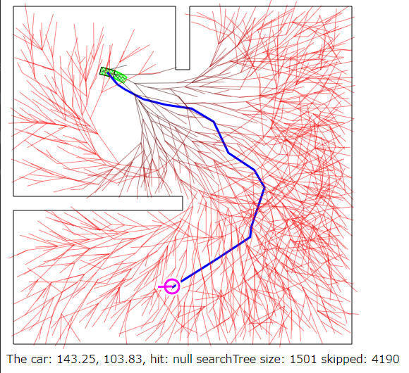

# RRT* search demo

Very simple script to demonstrate RRT* pathfinding.

Try it now on your browser! https://msakuta.github.io/RRTStarJS/

## Screenshot

## Status

Currently the path finding is very dumb and sometimes fails to find a path or even
follow a found path.
## How to build

This project assumes [deno](https://deno.land/) but you could use Node.js to build.

Compile with

    deno bundle --config tsconfig.json .\search.ts search.js
    deno bundle --config tsconfig-webworker.json .\search.ts search.js

because WebWorker script needs to be a separate file.
I tried to use [bundler](https://deno.land/x/bundler@0.7.0), but somehow it failed to compile for
web worker.
The web page and the web worker scripts have different library dependencies, so they need their own `tsconfig`s.

And start a file server by installing file server

    deno install --allow-net --allow-read https://deno.land/std@0.95.0/http/file_server.ts

and run it

    file_server .

and browse http://localhost:4507/ (or whatever the file_server tells to use).

## Reference

https://theclassytim.medium.com/robotic-path-planning-rrt-and-rrt-212319121378